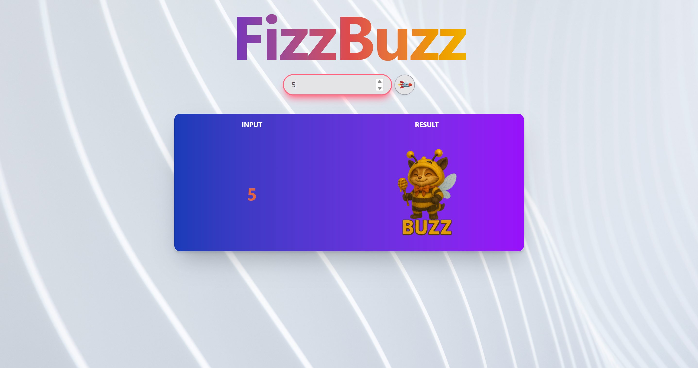
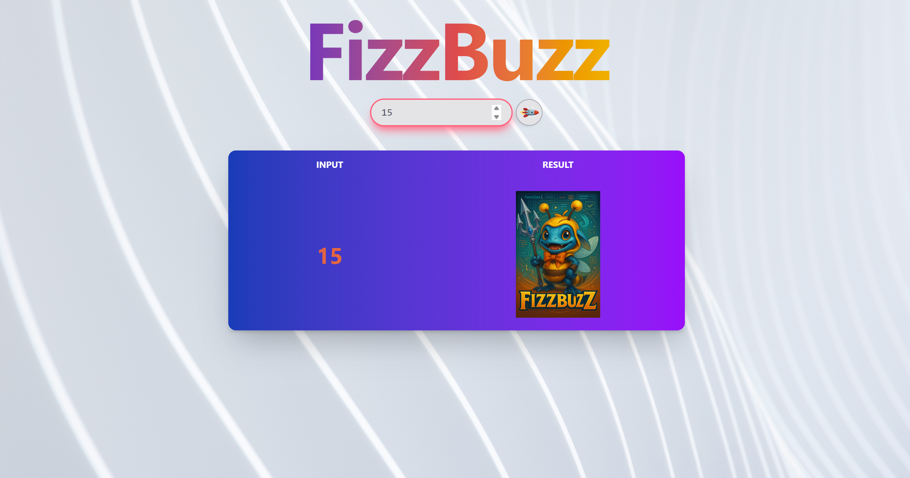

# 🧩 Test Level - FizzBuzz


## 🧠 Goals

- Put into practice JavaScript concepts.
- Good use of DOM manipulation.
- Build a functional fizzbuzz-app.
- Pass the tests using Jest.


## 🎥 Preview

### 🛍️ FizzBuzz-app View


---

### 3️⃣​ Fizz


---

### 5️⃣ Buzz


---

### 1️⃣5️⃣ FizzBuzz


---

## 🛠️ Getting Started

### 🟦 Clone this repository

```bash
git clone https://github.com/JlBestMc/Test-Level-Fizz-Buzz.git

```

### 🟩 Install Dependencies

Make sure you have Node.js installed. Then install the packages:

```bash
npm install
```

## 📁 Project Structure

```
📦 E-commerce
┣ 📂 src/
      ┣ 📂 core
         ┗ 📄 fizzbuzz.js  
      ┣ 📂 images
      ┣ 📂 styles
         ┣ 📄 input.css  
         ┗ 📄 output.css 
      ┣ 📂 ui
         ┣ 📄 dom.js  
         ┗ 📄 events.js
      ┗ 📄 main.js
┣ 📂 test/
      ┗ 📄 fizzbuzz.test.js

```


## 🛠 Technologies Used

- Base project:
    - Jest
- Updates:
    - JavaScript
    - HTML
    - CSS (Tailwind)
    - Jest


## ⏳ Project Status


